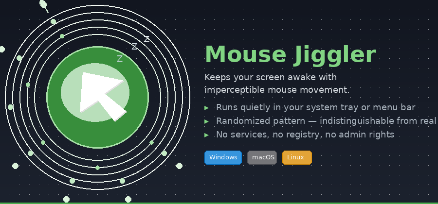

# 🖱️ Mouse Jiggler

<p align="center">
  
</p>

> Subtle, undetectable mouse movement from your system tray.
> **Cross-platform** — Windows, macOS (Apple Silicon), and Linux.

## ✨ Features

- **Runs in the system tray / menu bar** — click for Pause, Settings, or Quit
- **Randomized movement** — 1–N pixels in a random direction each tick — no predictable pattern
- **Single-instance** — won't accidentally run twice
- **Persistent config** — saves to your OS-native config directory
- **Zero runtime dependencies** — each platform uses its native language (no Python, no runtimes)

## 🔧 How It Moves the Mouse

| Platform | Language | UI Framework | Mouse Backend |
|----------|----------|-------------|----------------|
| **Windows** | C# (.NET 8) | WinForms | Win32 `SendInput` API |
| **macOS** | ObjC | Cocoa | CoreGraphics `CGEvent` |
| **Linux** | Go | systray | Xlib `XWarpPointer` |

## 🔒 Why IT Won't Flag It

| Concern | How Mouse Jiggler handles it |
|---------|------------------------------|
| **Input detection** | Uses OS-native input APIs — identical to physical hardware |
| **Services/daemons** | None — runs as a normal user process |
| **Registry/plists** | Zero system writes — config is a plain JSON file |
| **Admin/root** | None needed — standard user permissions |
| **Startup** | No auto-start entries — you launch it when you need it |
| **Pattern detection** | Random direction + random distance — no repeating pattern |

## 🚀 Quick Start

### Windows

Download the latest `MouseJiggler.exe` from [GitHub Actions](https://github.com/jphermans/mouse-jiggler/actions).

To build from source:
```bash
dotnet publish MouseJiggler.Windows.csproj -c Release -r win-x64 --self-contained -p:PublishSingleFile=true -o dist
```

### macOS

**Requirements:** macOS 11+ (Big Sur or later)

Download the latest `MouseJiggler-macOS.zip` from [GitHub Actions](https://github.com/jphermans/mouse-jiggler/actions).

Unzip, then right-click → **Open** the first time (unsigned developer).

> **Note:** To control the mouse, enable **Mouse Jiggler** in **System Settings → Privacy & Security → Accessibility**.

To build from source:
```bash
clang -O2 -framework Cocoa -framework CoreGraphics -framework ServiceManagement \
  -o MouseJiggler mouse_jiggler_macos.m
```

### Linux

Download the latest `MouseJiggler` binary from [GitHub Actions](https://github.com/jphermans/mouse-jiggler/actions).

Make it executable and run:
```bash
chmod +x MouseJiggler && ./MouseJiggler
```

To build from source:
```bash
sudo apt install libx11-dev libgtk-3-dev
go build -tags="no_appindicator" -ldflags="-s -w" -o MouseJiggler mouse_jiggler_linux.go
```

## ⚙️ Settings

| Setting | Range | Default | Description |
|---------|-------|---------|-------------|
| **Interval** | 30s–10min | 60s | Time between jiggles |
| **Max pixels** | 1–10 px | 3px | Maximum random offset per move |

- **Windows:** Right-click tray icon → "Settings" (WinForms GUI with sliders)
- **macOS:** Menu bar presets (Interval/Pixels submenus) or "Open Config File"
- **Linux:** Right-click tray icon → Interval/Pixels submenus or "Open Config File"

| Platform | Config path |
|----------|-------------|
| Windows | `%APPDATA%\Mouse Jiggler\config.json` |
| macOS | `~/Library/Application Support/Mouse Jiggler/config.json` |
| Linux | `~/.config/mouse-jiggler/config.json` |

## 🤖 GitHub Actions

Every push to `main` automatically builds for all three platforms. No Python, no pip — each platform uses its native toolchain.

| Artifact | Runner | Language |
|----------|--------|----------|
| `MouseJiggler.exe` | `windows-latest` (x64) | C# / .NET 8 |
| `MouseJiggler-macOS.zip` | `macos-latest` (Apple Silicon) | ObjC / clang |
| `MouseJiggler` | `ubuntu-22.04` (x64) | Go |

Download the latest from the [Actions tab](https://github.com/jphermans/mouse-jiggler/actions).

To create a release with all binaries:
```bash
git tag v1.0.0 && git push origin v1.0.0
```

## 📁 Project Structure

```
mouse-jiggler/
├── mouse_jiggler_windows.cs     # Windows (C# .NET 8)
├── MouseJiggler.Windows.csproj  # Windows project file
├── mouse_jiggler_macos.m        # macOS (ObjC — native Cocoa)
├── mouse_jiggler_linux.go       # Linux (Go + systray + Xlib)
├── go.mod                       # Go module file
├── AppIcon.icns                 # macOS app icon
├── generate_macos_icon.py       # macOS icon generator
├── generate_readme_banner.py    # README banner generator
├── readme_banner.png            # README hero image
├── mouse_jiggler.ico            # Windows icon (legacy)
├── .gitignore
└── .github/workflows/
    └── build.yml                # CI: build all three platforms
```

## 📄 License

MIT — use it, fork it, share it.
